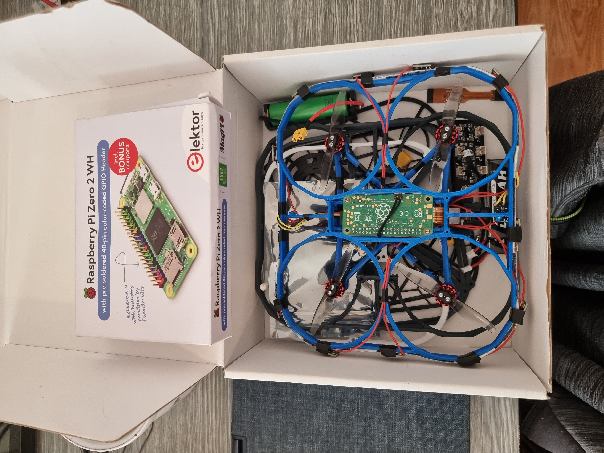
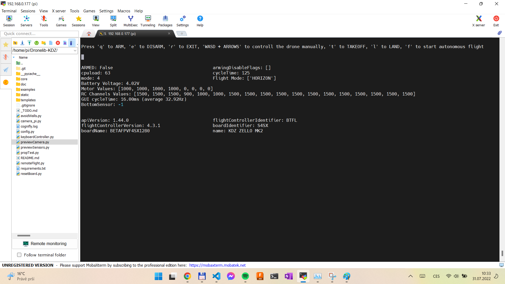
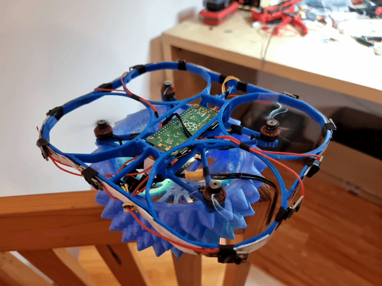
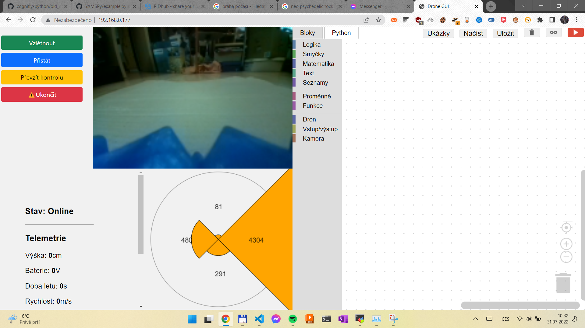
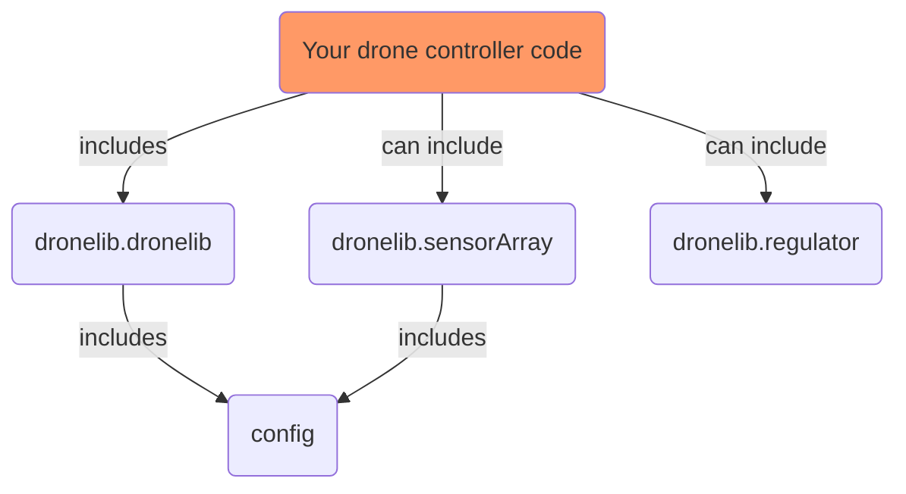
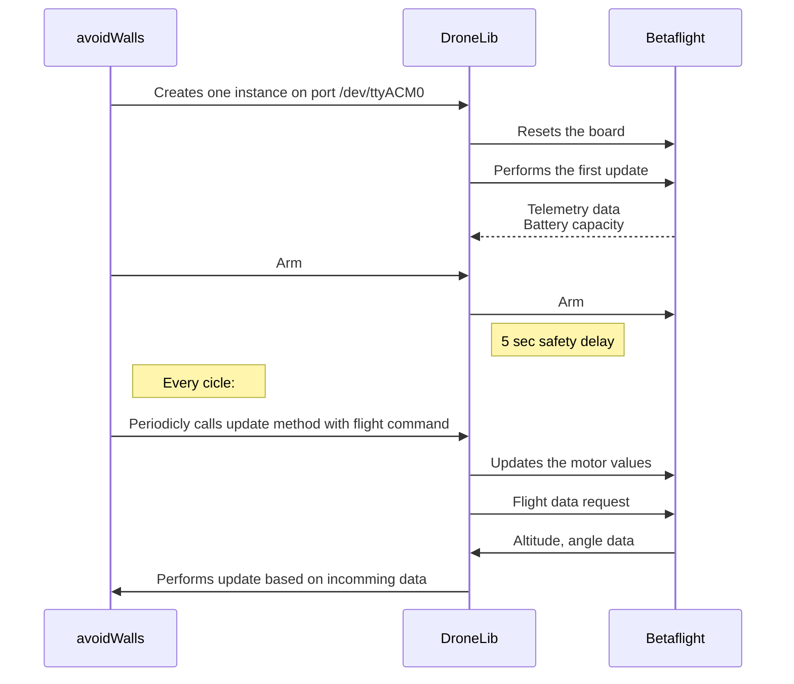
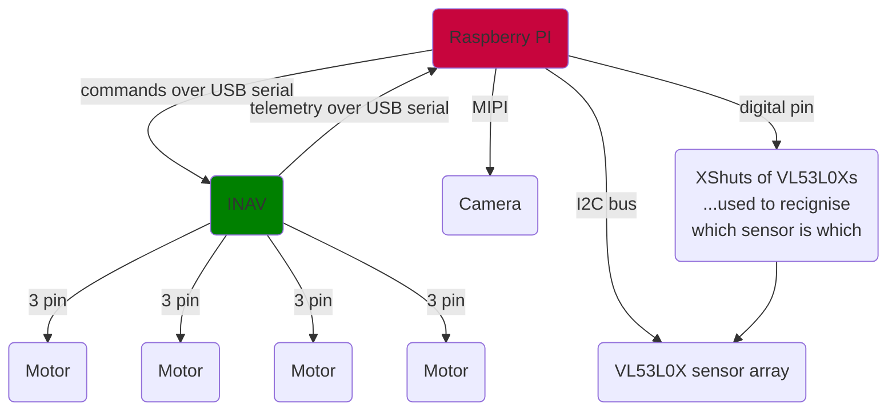
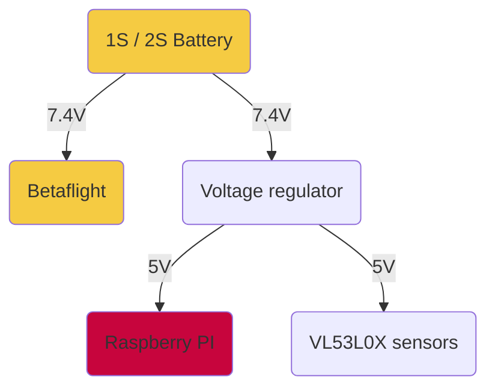

# DroneLib documentation

DroneLIB is python package for raspberry-pi microcomputers. It is capable of communicating with the Betaflight 4 powered boards, send them controll data, recieve 




# Examples

All ready to launch exapmles are placed in the folder examples. 

## avoidWalls.py
This code is deprecated and was replaced by the keyboardController code.

This code takes off and avoids obstacles around the drone. Example usage of sensorArray library.

The code begins with creating an DrobeLib object, which causes the drone to completely preare for it´s flight. Further details can be see in the communication diagram below, which shows, how exactly is the communication done. 

In the main loop, there is 3 dimensional vector calculated, based on each sensor distances measured. Each dimension is being regulated separely based on its own pid controller. Final 3 dimensional vector is finally applied on the drone to make it "avoid its obstacles".

This code is the most powerful with optical flow cammera bound to the betaflight board. If there is no optical flow camera present, the drone will drift away uncontrolled after avoiding an obstacle and possibly crash to another! Proportional values in XY regulators need to be lowered significantly if there is no positioning applied.

### How to run this example code
1) Start up the drone
2) Connect via ssh to the drone, default login is ```pi``` and default password is ```raspberry```
3) Locate the repository folder and run command ```python3 avoidWalls.py```


## keyboardController.py
This code is a simple example of controlling the drone with keyboard. It is capable of sending commands to the drone and recieving data from the drone. It implements a different library - YAMSPY - which is capable of sending and recieving data from the drone better, than ours api. It has also been added to the dependencies.



This code features automatic altitude control, which is based on the drone´s bottom sensor value. This feature can be enabled or disabled at the beginning of the code.

If turned on, the code features "autonomous mode", in which it tries to hold positon based on its side sensor array.

Further code details and descreption can be found inside the code itself.


### Example video (Click to open)

[](https://youtu.be/ZrR0bh-Ggdk)


### How to run this example code
1) Start up the drone
2) Connect via ssh to the drone, default login is ```pi``` and default password is ```raspberry```
3) Locate the repository folder and run command ```python3 keyboardController.py```

## previewCamera.py
By running this code, the camera webserver will be started. It will show the live stream of the camera. You can reach the camera stream by opening a browser and typing the drone ip address. The default port is 80 - the default http port. This code can be run the same way as the previewSensors.py code, which previews camera including all of the active sensors.

## previewSensors.py
This code is capable of previewing the sensors data. It hosts a webserver, which can be accessed by opening a browser and typing the drone ip address. The default port is 80 - the default http port. This gui shows the main controll panel including the camera preview, sensors panel, and the main programming gui (which is imported from the Drobockly enviroment, just a placeholder for now).

### Example video (Click to open)

[](https://youtu.be/xSEpj36rMqs)

### How to run this example code
1) Start up the drone
2) Connect via ssh to the drone, default login is ```pi``` and default password is ```raspberry```
3) Locate the repository folder and run command ```python3 previewSensors.py```
4) Start a browser on your computer and type the drone ip address and press enter.

## resetBoard.py
Example code, which resets the drone board. Resseting the board is called after each \_\_init\_\_  of the DroneLib class. As simple as that:
```
#!/usr/bin/env python
from core.dronelib import DroneLib
from core.sensorArray import SensorArray
sa = SensorArray()

if __name__ == "__main__":
	drone = DroneLib("/dev/ttyACM0")
```

### How to run this example code
1) Start up the drone
2) Connect via ssh to the drone, default login is ```pi``` and default password is ```raspberry```
3) Locate the repository folder and run command ```python3 resetBoard.py```


# How it works?

This is how the import dependencies of dronelib modules are laid out:

### Packages description:
- core.dronelib
	> Contains class ```DroneLib```, which is responsible for all communication with the betaflight board.
	> One instance of this class represents one drone connection, contructor requires one parameter - serial port of the drone, default is ```"/dev/ttyACM0"```

To generate the documentation for this package, run:
```
python -m pydoc -w core\dronelib.py
```

- core.sensorArray
	> Communicates with all of the sensors placed on the drone. All sensor positions and features can be changed in config file described further down. This package features asynchronous communication with VL53L0X sensors and at the beginning, changes their address properrly, so they can communicate on the I2C bus withut disturbing another sensors.

To generate the documentation for this package, run:
```
python -m pydoc -w core\sensorArray.py
```
- core.regulator
	> Includes improved PID regulator with simulator and other utilities capable of tuning up the regulator proportional, derivational and integrational constants. Simulator can be run separely and was used during the development to approprietly adjust the values of the drone regulators.

To generate the documentation for this package, run:
```
python -m pydoc -w core\regulator.py
```
- config
	> Here you can adjust the minimal voltage required for takeoff and tof sensor positions and other properties.
	To edit the configuration, use your favourite editor, or run command
	```nano config.py```


## Communication diagram

This diagram shows communication in avoidWalls.py exmaple program. 


# Drone specifications

Each of our prototype drone has its own features and differs a little bit compared to its other versions. However, these specifications are similar across all our prototypes, as they are the neccesarity to make everything compatible.


## Drone signal connection schema
Which protocols are being used among all the components:

## Drone voltage distribution schema
How different voltages are being distributed:


## Used parts
Informations about the parts we used and other interesting info can be found in the word document here: (link na Jindrův soubor)

# Code documentation
The code is commented regulary and to generate the documentation, simply execute:
```
python -m pydoc -w core\dronelib.py
python -m pydoc -w core\sensorArray.py
python -m pydoc -w core\regulator.py
```
You will find all documentation files in the root folder.
